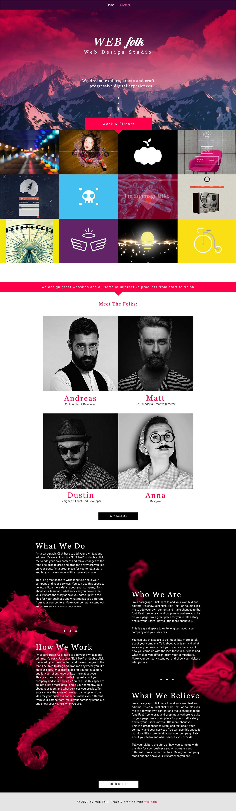
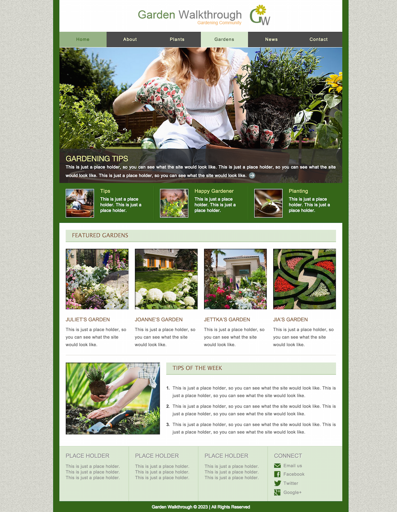

# Web integration
### web-integrators
| Technique                                                                                    | maquette |
|-------------------------------------------------------------------------------------------- | -------- |
| **Maquette 6**   Utiliser Préprocesseur de CSS: SCSS   Utiliser Framework CSS: Bootstrap 4   Organiser et realiser en Responsive web design   Integre Fontawesome   (en cours...) |  |
| **Maquette 5**   Utiliser Préprocesseur de CSS: SCSS   Utiliser Framework CSS: Bootstrap 4   Organiser et realiser en Responsive web design   Integre Fontawesome |  |
| **Maquette 4**   utiliser CSS Framework: Bootstrap 4   Organiser et realiser en Responsive web design   Integre Fontawesome |  |
| **Maquette 3**   utiliser CSS Framework: Bootstrap 4   Organiser et realiser en Responsive web design   Integre Fontawesome |  |
| **Maquette 2**   HTML et du CSS   Sans utiliser Flexbox et Grid System   Sans responsive web design   Integre le GoogleFont |  |
| **Maquette 1**   HTML et du CSS   Sans utiliserFlexbox et Grid System   Sans responsive web design |      |

